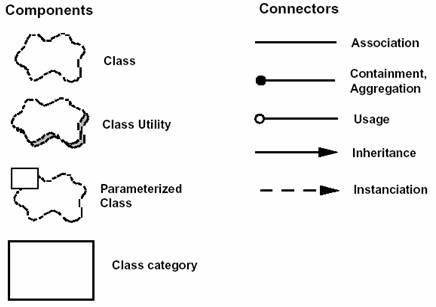
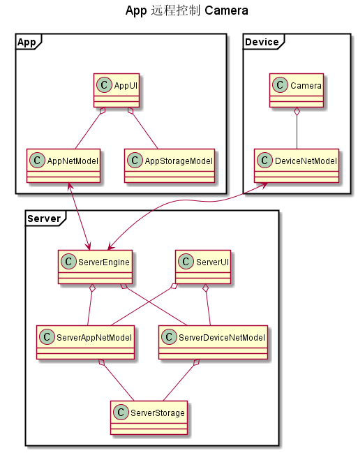
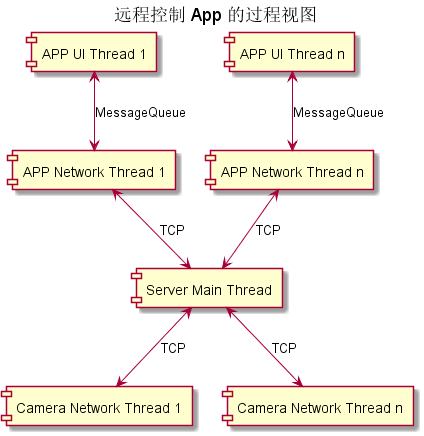

Title: 使用 4 + 1 视图模型来表达系统架构
Date: 2015-12-24 15:36
Modified: 2015-12-24 15:36
Slug: architecture-view
Authors: Joey Huang
Summary: 本文通过具体案例来演示怎么样通过 4 + 1 视图模型来表达系统架构
Status: draft

## 4 + 1 视图模型的简介

4 + 1 视图模型是由 [Philippe Kruchten][1] 最先提出来的用来表达软件系统架构的一个方法。它用下面的四种视图来从不同的层面表达系统架构：

* 逻辑视图（Logical View），设计的对象模型（使用面向对象的设计方法时）。
* 过程视图（Process View），捕捉设计的并发和同步特征。
* 物理视图（Physical View），描述了软件到硬件的映射，反映了分布式特性。
* 开发视图（Development View），描述了在开发环境中软件的静态组织结构。


下面是几个有用的参考资料：

* wikipedia 上的一个[简介][2]
* Philippe Kruchten 的[论文原文][3]
* IBM 网站上有这篇[论文的中文版][4]
* IBM 网站上还有一篇简单的使用这一思想进行架构设计的[例子][5]

> 并不是所有的软件架构都需要"4＋1"视图。无用的视图可以从架构描述中省略，比如： 只有一个处理器，则可以省略物理视图；而如果仅有一个进程或程序，则可以省略过程视图。 对于非常小型的系统，甚至可能逻辑视图与开发视图非常相似，而不需要分开的描述。场景对于所有的情况均适用。 --- Philippe Kruchten

针对不同规模，不同性质的软件，4 + 1 视图方法并不总是适用。核心问题是：**把系统架构表达清楚**。

## 逻辑视图
c
逻辑视图的核心目的，是通过理解需求来**解构系统**，即把系统分解为一个个模块，定义好每个模块的接口和交互方式。在系统设计层面，如果使用的是面向对象的设计方法，可以使用 UML 的对象模型（包图）来表达。如果使用最朴素的设计方法，就是把系统划分成一个个模块，并且表达好每个模块向外提供的功能接口，最终这些模块能支撑整个系统的需求。如果针对模块设计层面，一般还可以使用状态图来表达模块内部的细化的结构。

逻辑视图使用两个图例来表达：

* 组件：系统划分为哪几个组件？这些组件可以是类，类集合，甚至是子模块。
* 组件间的关系：总共有五种关系
    * Association: 协作。即组件之间处于同一个层级，通过协同工作来对外提供功能。组件间用直线来表示。
    * Containment: 包含。即一个组件包含另外一个组件。用一头带实心圆的直线来表示，其中实心圆指向容器方。
    * Usage: 使用。即一个组件使用另外一个组件作为其下一层，以便提供它的功能。使用空心圆的直线来表示，其中空心圆指向使用方。
    * Inheritance: 继承。即一个组件是另外一个组件的子类。使用带方向箭头的实线表示，箭头指向父类。
    * Instanciation: 实例化。即一个组件是另外一个组件的实例。使用带方向箭头虚线表示，箭头指向被实例化的组件。



### 类之间的关系

[http://www.cnblogs.com/liuling/archive/2013/05/03/classrelation.html](http://www.cnblogs.com/liuling/archive/2013/05/03/classrelation.html) 这是一篇很简洁的描述类之间关系的文章。

下面我们使用 Java 代码来举例演示类之间的关系。

**继承和实现 Inheritance/Extension**

```java
// 继承
class ClassA {

}

class ClassB extends ClassA {

}

// 实现
interface InterfaceA {
    public void methodA();
}

class ClassIA implements InterfaceA {
    public void methodA() {}
}
```

**依赖关系 Dependence**

```java
class ClassB {

}

// ClassA 依赖 ClassB，偶然性，临时性的弱依赖。ClassB 作为 ClassA 的一个方法的参数。
class ClassA {
    public void methodA(ClassB b){

    }
}
```

**关联关系 **

```java
class ClassB {

}

/*
 * 关联关系：ClassA 与 ClassB 关联，这是确定性的强依赖
 */
class ClassA {
    private ClassB mB;
}
```

关联关系包含两个层次更深的特例，聚合和组合。

* 聚合 Aggregation
  ClassA **HAS** ClassB，表达的是整体和局部的关系。在聚合关系里，整体和局部是可分离的。比如一个 App 使用 MVC 模型来设计，此时界面部分 View 和 模型部分 Model 是聚合的关系。他们有各自的生命周期，是可分离的，Model 可以独立于 View 存在，用来实现后台数据更新等功能。
* 组合 Composition
  ClassA **CONTAINS** ClassB，表达的也是整体和局部的关系，但这时两者是不可分离的，部分的生命周期与整体的生命周期相同。比如一个负责从服务器获取最新数据的网络组件和 Socket 组件就是组合的关系。在这个组合关系里，如果网络组件销毁了，它所拥有的 Socket 组件也同时销毁。

### 示例

我们以一个 App 通过远程服务器控制家里的摄像头为例，来说明逻辑视图如何从功能角度来描述系统架构，以及模块划分。



逻辑视图在软件总体设计里体现的意义不大，因为总体设计不会涉及模块内部的细节。逻辑视图在模块详细设计里的意义比较大，可能比较清楚地表达出模块内部的详细结构，即模块内部的子模块及关键方法和属性的表达。

## 过程视图

过程视图考虑一些非功能性的需求，如性能和可用性。它解决并发性、分布性、系统完整性、容错性的问题，以及逻辑视图的主要抽象如何与进程结构相配合在一起。

进程架构可以在几种层次的抽象上进行描述，每个层次针对不同的问题。在最高的层次上，进程架构可以视为一组独立执行的通信程序。


过程视图的通信

* 消息
* RPC 远程调用
* 双向消息
* 事件广播

### 示例



## 开发视图

开发架构关注软件开发环境下实际模块的组织。软件打包成小的程序块（程序库或子系统），它们可以由一位或几位开发人员来开发。子系统可以组织成分层结构，每个层为上一层提供良好定义的接口。

## 物理视图

物理视图表达的是软件至硬件的映射，即系统的硬件拓扑结构。特别是对服务器类项目，需要描述可用性、可靠性（容错性），性能（吞吐量）和可伸缩性。


[1]: https://en.wikipedia.org/wiki/Philippe_Kruchten
[2]: https://en.wikipedia.org/wiki/4%2B1_architectural_view_model
[3]: http://www.cs.ubc.ca/~gregor/teaching/papers/4+1view-architecture.pdf
[4]: http://www.ibm.com/developerworks/cn/rational/r-4p1-view/index.html
[5]: http://www.ibm.com/developerworks/cn/rational/06/r-wenyu/index.html


