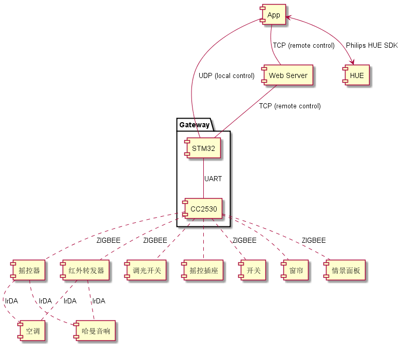
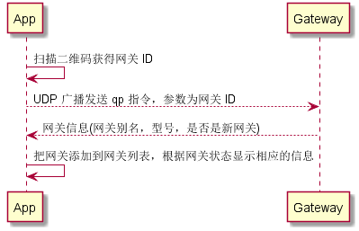
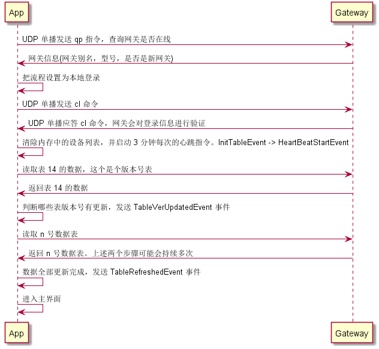
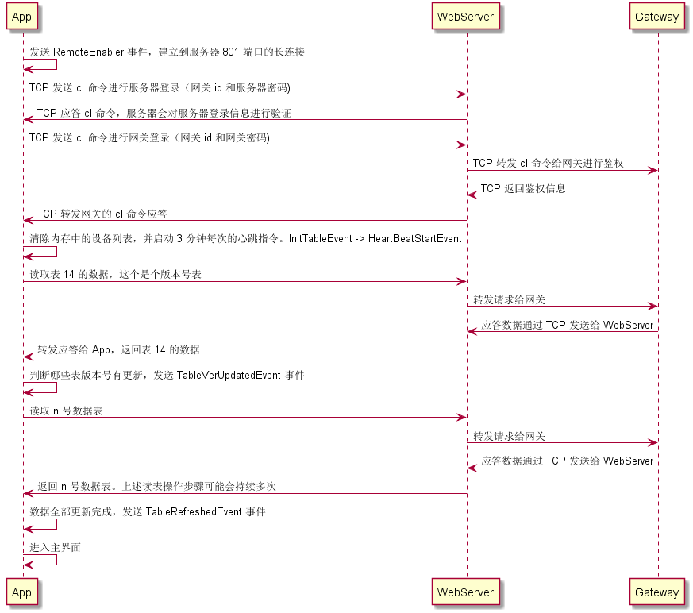
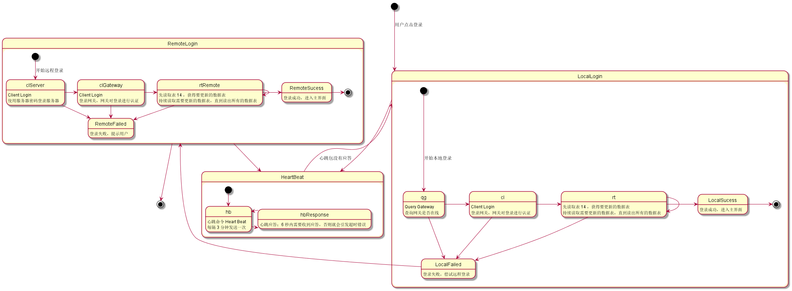
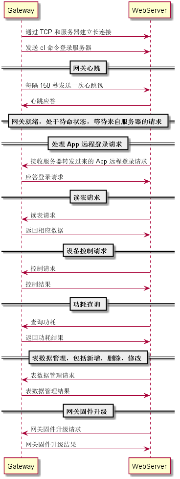

Title: i-jia architecture and main flow overview
Date: 2015-10-13 09:36
Modified: 2015-10-13 09:36
Slug: i-jia-arch
Authors: Joey Huang
Summary: i-jia architecture and main flow overview
Status: draft

# i-家系统架构及主要流程情景分析

本文通过梳理i-家系统的典型流程及通过情景分析来来理清i-家系统的架构。

[TOC]

## 系统拓扑结构



一些说明：

* UDP 通信特点：支持多播，支持点对点。是不可靠的通信协议。
* TCP 通信特点：只支持点对点，需要在通信之前建立连接。是可靠的通信协议。
* HUE 功能：目前的设计，HUE 功能是 App 直接和 Hue 网关通信，不经过我们自己的网关，这种架构在产品本身体验上就有一些一致性问题，典型地我们的情景面板无法控制 HUE 灯。


## 添加网关流程

用户拿到网关后，布置好网络，让网关和 APP 在同一个局域网，就可以添加网关了，其流程如下



一些说明：

* 发现网关的过程使用了 UDP 广播
* 如果 App 发出后广播 3 秒内没有收到应答，就会提示用户。这个可能原因是网关和手机没在同一个局域网。或者 UDP 广播丢失。
* 如果是新网关，则 App 会提示是个新网关，提示用户用默认用户名和密码登录
* 同一个局域网里可能有多个网关，网关收到 qg 命令时，需要检查只有和自己的 id 匹配才可以发送应答


## 本地登录

用户添加好网关后，就可以在局域网内登录到网关了。其流程如下




一些说明：

* 登录时为什么要再查询一次网关呢？这是因为扫码添加网关到真正登录网络可能发和了变化。如果这个时候查询不到网关，则会偿试远程登录。
* cl 是客户登录的命令 (Client Login的缩写)，其关键参数是网关 id 和密码。密码使用 md5 摘要，而不是直接发送明文的密码。这里面实际上有个更安全的措施，即添加 salt 机制，可以在登录查询指令里服务器返回一个 salt 随机数，在发送密码时，可以把密码和 salt 合并起来算 md5。
* cl 命令发送后 10 秒内没有收到网关应答，即提示用户超时。
* Gateway 应答时，告诉客户端登录成功还是失败。典型地比如密码错误。或如果是管理员登录，且此时已经有管理员已经登录了，则这个时候会告诉 App 已经有管理员登录了。
* 登录过程中会开启心跳包流程。即每 3 分钟发送一个心跳包给网关。如果没收到应答，就会认为掉线了。 App 检测到掉线后，3 秒内会进行重新登录。重新登录时会先偿试本地登录，如果本地无法登录，就会偿试远程登录。如果远程登录也失败了，会隔 3 分钟后重试。重试时，也是先偿试本地登录，再偿试远程登录。
* 表 14 是数据库版本表。我们实际上有 19 个表，保存整个系统的不同信息。表 14 是保存这些数据表的版本信息。数据表由网关维护，每次数据有更新时，版本号都会递增。比如有个新设备加入网络了，那么设备信息表就会更新。App 通过读取表 14 就知道是否需要把所有数据都更新或者只需要更新部分数据。这就是为什么第一次登录时间比较长，登录一次以后再次登录时间短的原因。
* UDP 通信的弊端：读表的过程也体现了 UDP 通信的弊端。如果数据量比较大，超过 MTU (1500字节)，就需要分包传输，如果分成 10 个包，哪个包先到，哪个包后到，中间如果丢了一个包，就需要重传。这增加了系统实现的复杂性，降低了可靠性。特别是在网络状况比较差的时候，更是雪上加霜。
* 更新完表 14 后我们就知道哪些表需要重新读取，继续发读表命令 rt (Read Table) 读取数据表
* 数据表全部更新完成后，登录流程完成，进入 App 的主界面

附录一：系统的数据表

```java
    // 设备入网信息表
    public static final short TABLE_DEV_JOIN_INFO = 1;
    // 地址映射表
    public static final short TABLE_ADDR_MAP = 2;
    // 设备信息表
    public static final short TABLE_DEV_INFO = 3;
    // 楼层和房间表
    public static final short TABLE_ROOM = 4;
    // 情景模式名称表
    public static final short TABLE_SCENE_NAME = 5;
    // 情景模式绑定表
    public static final short TABLE_SCENE_BIND = 6;
    // 遥控器绑定表
    public static final short TABLE_REMOTER_BIND = 7;
    // 红外设备红外码表
    public static final short TABLE_IR_CODE = 8;
    // 定时任务表
    public static final short TABLE_TIMER_TASK = 9;
    // 摄像头表
    public static final short TABLE_CAMERA = 10;
    // 房间布置表
    public static final short TABLE_ROOM_ARRANGE = 11;
    // 联动表
    public static final short TABLE_LINK_ACTION = 12;
    // 防区表
    public static final short TABLE_ARARM_ZONE = 13;
    // 版本号表
    public static final short TABLE_VERSION = 14;
    // 设备状态表
    public static final short TABLE_DEV_STATUS = 15;
    // 网关信息表
    public static final short TABLE_GATEWAY = 16;
    // 报警记录表
    public static final short TABLE_ALARM_LOG = 17;
    // 插座功耗表
    public static final short TABLE_SOCKET_POWER = 18;
    // 扩展设备配置表 for HUE
    public static final short TABLE_EXT_DEVICE = 19;
```

## 远程登录

App 问题会先试图进行本地登录，当本地登录失败后才会进行远程登录。



**远程登录和本地登录的一些不同点**：

* 有两次 cl 命令，一次是登录服务器，一次是登录网关
* App 和服务器以及服务器和网关之间都建立了 TCP 长连接。
* 长连接为什么还要心跳呢？因为网络通信的复杂性，有时候会造成连接实际上已经关闭了，即数据通道已经断了，发不了数据了，但在编程角度来讲 socket 没有收到连接断开的事件，导致 App 或网关认为和服务器的长连接还有效。所以需要定期的心跳数据包来检测连接的有效性。
* 服务器作为透传服务器，而不是缓存管理服务器。即 App 请求的所有的数据都由服务器向网关请求后返回给 App。

**透传服务器带来的问题**：

* 通信比较慢，需要转发请求才能应答，响应基本上是正常通信的两倍时间
* 没有实现智能的框架。智能要求服务器对用户个人信息，操作习惯，生活习惯进行深度机器学习。然后提供一些符合用户个人习惯的建议和提醒。
* 没有实现多屏交互。典型地，如果用 HTML5 实现在网页端对设备进行控制，那么可以绑定微信服务号，直接在微信里面进行操作，有利推广和便利性
* 长连接需要有负载匀称技术。一般来讲，一台服务器能支持的长连接数量是有限制的，理论最大值是 65535，这个限制是服务器通信的端口号的限制。实际上达不到这个上限。因为内存和文件句柄也会进一步限制。在服务器运维层面，需要综合考查及实际环境验证才能得出可信的数据。

## 登录状态图

登录过程中的状态比较多，其中还涉及到很多状态转换，这里只从比较 High Level 描述登录的状态。



关于心跳包

* 心跳包是 3 分钟发送一次。这意味着，可能在 3 分钟内失去连接而没被发现。从用户体验的角度来讲，可能会出现有时候操作没有响应，再过几分钟就好了。
* 心跳包的频率能不以加快？这个需要综合权衡。假设一个心跳包数据包是 2 字节，加上 tcp/ip 协议包就有上百字节，假设是 200 bytes，那么假如我们有 100,000 个连网终端，那么数据流量将达到 20MB/3min ，即 111KB/S 。这个数据随着终端数量增长呈线性关系，和心跳包的频率也呈线性关系。当终端数量很大或心跳包频率很快的时候可能会造成大量的流量费用。给服务器也带来比较大的负载消耗。

## 网关登录

网关需要登录服务器才能实现远程控制的功能。下面是网关登录的流程。



* 网关会每隔 150 秒发送心跳包到服务器。如果服务器超过 150 秒没收到网关的心跳包，就会认为网关掉线，这样无程登录时服务器会提示用户网关不在线。
* 目前网关在线升级只写了升级 STM32 的代码，且没有验证过。升级 CC2530 的代码目前没有，升级后端 ZIGBEE 设备的代码也没有。
* 现有 i-jia 2 实现 OTA 的可行性如何？技术上是完全可行的，有以下几件事要做
    * 需要一个固件存储服务器，用来对固件进行维护及支撑设备固件升级
    * 需要修改现有的网关，支持从固件存储服务器上下载其他系统的固件，并通过 UART 发送给网上的 CC2530 系统
    * 所有相关的 ZIGBEE 设备需要支持固件升级命令，能从协调器接收固件，并对自身固件进行升级
    * 需要修改 App 端，支持从固件存储服务器检查新版本，并把新版本信息，如版本号，固件地址等发送给网关
    * 需要增加 App 和网关交互机制，让 App 能知道网关及其他设备固件升级的过程状态信息，如下载进度，升级完成事件等

## 关键数据结构

本节介绍几个关键数据结构，实际上在 i-jia 系统中数据结构的复杂度和数量还是比较多的。

### 入网设备表 － 表 1

入网设备表保存了所有的入网的物理设备列表。

```c
typedef struct DeviceInfoTable_t{
    struct DeviceInfoTable_t *Next;
    u16 Len;                // 保存在数据库中的数据长度
    u16 Index;              // 在数据库中的索引
    u8  extAddr[8];         // 设备的 MAC 地址
    u8  capabilities;       // App 端没有使用。网关用这个字段来标识出协调器
    u8  activeType;
    u8  EndPointCNT;
    u8  EndPointRspCNT;
}DeviceInfoTable_Typedef;
```

### 设备信息表 － 表 3

在 App 端，设备信息表是保存在数据库里的。在网关，设备信息表是保存在 Flash 里。他们之间通过表 3 进行传输。

设备信息在网关的数据结构如下

```c
typedef struct DeviceInfoDetailTable_t{
    struct DeviceInfoDetailTable_t *Next;
    u16 Len;                // 保存在数据库中的数据长度
    u16 Index;              // 在数据库中的索引
    u8  extAddr[8];         // 设备的 MAC 地址
    u8  EndPoint;           // 设备的端点号
    u8  deviceName[16];     // 设备名称
    u16 AppDeviceID;        // 设备类别 ID
    u16 DeviceType;         // 设备类型
    u8  roomNo;             // 设备所在的房间号，新入网设备默认为 0xFF
    u8  roomNo;             // 没有使用
    u8  minRange;           // 没有使用
    u8  maxRange;           // 没有使用
    u32 standarIRno;        // 没有使用
    u8  InClustersNum;      // 输入簇个数，目前没有使用
    u8  OutClustersNum;     // 输出簇个数，目前没有使用
    u16 IOClusters;         // 输入输出簇的数据，这里实际上是一个动态长度数组，除情景面板，目前没有使用
} DeviceInfoDetailTable_Typedef;
```

**一些信息**：

* 设备地址：每个zigbee设备拥有一个唯一的 MAC 地址。协调器（coordinator）在建立网络以后使用 0x0000 做为自己的短地址。在路由器 (router) 和终端 (enddevice) 加入网络以后，使用父设备给它分配的16位的短地址来通讯。
* 设备的端点号：类似于 TCP/IP 通讯中的端口的概念。即 MAC 地址标识出了一个物理设备，但一个物理设备上可能会包含多个服务，如何区分这些服务呢？用的就是端点号。比如 ZSW07 项目，设备只有一个，MAC 地址也只有一个，但会有 4 个 EndPoint，分别代表三个开关的一个情景面板开关。EndPoint 只要在设备内部唯一即可。
* 设备名称：这个是用户可辨识的名称，比如“灯光7”。当新设备入网时默认名称是空字符串，App 如果发现设备名称是空字符串，就显示默认名称。如果用户修改了设备的名称，如改成“厨房吊灯”，那么这个数据 App 会发送给网关，最终在网关那边保存起来。
* 设备类别 ID：用来标识设备的类型信息，ZIGBEE HA 协议总共规范了几十种设备，目前 i-jia 系统只实现了部分设备

```c
// Generic Device IDs
#define ZCL_HA_DEVICEID_ON_OFF_SWITCH                           0x0000  // 普通开关
#define ZCL_HA_DEVICEID_LEVEL_CONTROL_SWITCH                    0x0001  // 调幅开关
#define ZCL_HA_DEVICEID_ON_OFF_OUTPUT                           0x0002  // 遥控插座
#define ZCL_HA_DEVICEID_LEVEL_CONTROLLABLE_OUTPUT               0x0003
#define ZCL_HA_DEVICEID_SCENE_SELECTOR                          0x0004  // 情景面板
#define ZCL_HA_DEVICEID_CONFIGURATION_TOOL                      0x0005
#define ZCL_HA_DEVICEID_REMOTE_CONTROL                          0x0006  // 遥控器
#define ZCL_HA_DEVICEID_COMBINED_INTERFACE                      0x0007  // 网关
#define ZCL_HA_DEVICEID_RANGE_EXTENDER                          0x0008  // 路由中继器
#define ZCL_HA_DEVICEID_MAINS_POWER_OUTLET                      0x0009
#define ZCL_HA_DEVICEID_DOOR_LOCK                               0x000A
#define ZCL_HA_DEVICEID_DOOR_LOCK_CONTROLLER                    0x000B
#define ZCL_HA_DEVICEID_SIMPLE_SENSOR                           0x000C
#define ZCL_HA_DEVICEID_CONSUMPTION_AWARENESS_DEVICE            0x000D
#define ZCL_HA_DEVICEID_HOME_GATEWAY                            0x0050
#define ZCL_HA_DEVICEID_SMART_PLUG                              0x0051
#define ZCL_HA_DEVICEID_WHITE_GOODS                             0x0052
#define ZCL_HA_DEVICEID_METER_INTERFACE                         0x0053

// This is a reserved value which could be used for test purposes
#define ZCL_HA_DEVICEID_TEST_DEVICE                             0x00FF

// Lighting Device IDs
#define ZCL_HA_DEVICEID_ON_OFF_LIGHT                            0x0100
#define ZCL_HA_DEVICEID_DIMMABLE_LIGHT                          0x0101  // 调光灯
#define ZCL_HA_DEVICEID_COLORED_DIMMABLE_LIGHT                  0x0102
#define ZCL_HA_DEVICEID_ON_OFF_LIGHT_SWITCH                     0x0103
#define ZCL_HA_DEVICEID_DIMMER_SWITCH                           0x0104
#define ZCL_HA_DEVICEID_COLOR_DIMMER_SWITCH                     0x0105
#define ZCL_HA_DEVICEID_LIGHT_SENSOR                            0x0106
#define ZCL_HA_DEVICEID_OCCUPANCY_SENSOR                        0x0107

// Closures Device IDs
#define ZCL_HA_DEVICEID_SHADE                                   0x0200
#define ZCL_HA_DEVICEID_SHADE_CONTROLLER                        0x0201
#define ZCL_HA_DEVICEID_WINDOW_COVERING_DEVICE                  0x0202
#define ZCL_HA_DEVICEID_WINDOW_COVERING_CONTROLLER              0x0203

// HVAC Device IDs
#define ZCL_HA_DEVICEID_HEATING_COOLING_UNIT                    0x0300
#define ZCL_HA_DEVICEID_THERMOSTAT                              0x0301
#define ZCL_HA_DEVICEID_TEMPERATURE_SENSOR                      0x0302
#define ZCL_HA_DEVICEID_PUMP                                    0x0303
#define ZCL_HA_DEVICEID_PUMP_CONTROLLER                         0x0304
#define ZCL_HA_DEVICEID_PRESSURE_SENSOR                         0x0305
#define ZCL_HA_DEVICEID_FLOW_SENSOR                             0x0306
#define ZCL_HA_DEVICEID_MINI_SPLIT_AC                           0x0307

// Intruder Alarm Systems (IAS) Device IDs
#define ZCL_HA_DEVICEID_IAS_CONTROL_INDICATING_EQUIPMENT        0x0400
#define ZCL_HA_DEVICEID_IAS_ANCILLARY_CONTROL_EQUIPMENT         0x0401
#define ZCL_HA_DEVICEID_IAS_ZONE                                0x0402
#define ZCL_HA_DEVICEID_IAS_WARNING_DEVICE                      0x0403
```

* 设备类型：对部分设备有效，用来标识主设备 AppDeviceId 下面的子设备的类型。比如当 AppDeviceId 为 0x00FD 红外转发器时，这个字段有效。用来标识红外转发器下面的子设备类型，其中 0x05 表示空调，0x06 表示电视，0x1001 表示 HARMAN BDS508，0x1002 表示 HARMAN SB35。另外我们注意到红外转发器的 AppDeviceId 0x00FD 没有出现在 ZIGBEE 协议里，因为协议没有这种设备，这是我们自己加的。而针当 AppDeviceId 为 0x03FD 湿度传感器、0x03FE 空气质量传感器、0x0402 安防传感器的时候，这个字段也是有效的，此时客户端根据 deviceType 来显示入网界面的设备类型。目前 i-jia 还不支持这些传感器以及安防传感器。
* 关于簇：目前数据结构时有些字段是没有使用的，关于簇的三个字段除情景面板外也没有使用。情景面板里，使用 ZIGBEE 规范定义之外的数值来区分情景面板上的按钮个数。
  实际上，在 ZIGBEE 里簇 (cluster) 是很重要的概念。ZIGBEE 联盟针对常用操作实现了 ZCL (zigbee cluster library) 程序包。这个程序包规范了一些标准设备的操作接口。假设我们要控制一个LED，有一个远程节点（发命令控制led ），一个本地节点（接受命令并真正的让led 亮起来)，那么如果引入 ZCL 的概念，你可以设置这个操作led 的事情是一个 cluster，其下包含三个命令，一个 open，一个 close，一个 read attribute，灯还有一个 attribute，那就是当前的 status，远程节点可以用ZCL的函数发 open 和 close 命令，也可以随时发一个 read attibute 命令读取本地节点 led 的状态。这么做的好处是不需要再自己设计一个规定（比如：一个数据包的第几个字节表示什么意思），而是直接调用ZCL即可实现，这对于 command 和 attribute 数量很少的应用不见得有多大好处，但是当 command 和 attribute 数量很多的时候，引入ZCL会让事情变得简单。
* 数据维护：设备信息表最终由网关进行维护，即 App 端每次登录的时候都需要从网关读取最新版本的设备信息表。当 ZIGBEE 网络有新设备加入时，网关会把设备信息表写入 Flash，同时发送给 App 端。这里有个数据同步问题，假设两个 App 同时打开，在控制 i-jia 系统。App 1 去搜索新设备，这个时候有个新设备加进来了，设备信息表会有一个新记录产生，App 1 由于在设备搜索界面，会开启一个 10 秒的定时器定时去读取设备信息表。而 App 2 在应用列表界面，没有轮询，所以新加进来的设备只有下次登录时才会显示出来。


## 结束语

这里为了容易理解，及突出重点的目的，只描述了简单情景及基本不考虑错误处理。实际系统中，情景之间的交互以及错误处理是非常重要的，且占据了设计和编码层面的超过一半以上的工作量。错误处理和情景交互也是 BUG 高发区，是系统稳定的关键。比如，针对网关，需要有线程去处理 TCP 数据，也需要有线程去处理 UDP 数据。因为一个网关可能被远程登录的 App 控制，也同时被本地登录的 App 控制。线程间锁机制，数据同步等都是比较复杂和重要的处理机制。本文没有展开分析。

另外一点，很多话题都没有展开讲，只从 High Level 描述了流程和数据流向。比如，在实际系统实现的过程中，如何保证在 UDP 通信不可靠的背景下实现了较好的用户体验，单单这一点就有很多技术细节可以展开和研究。

最后，希望本文能帮助你理解i-家系统的一些较高层次的软件信息。
