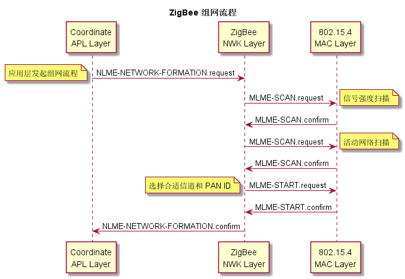

Title: ZigBee 网络层详解
Date: 2015-10-21 09:36
Modified: 2015-10-21 09:36
Slug: zigbee-networking-layer
Tags: zigbee
Authors: Joey Huang
Summary: ZigBee 网络层详解
Status: draft

## ZigBee 和 IEEE 802.15.4

ZigBee 和 IEEE 802.15.4 经常被混用，但实际上他们是完全不同的概念。IEEE 802.15.4 是由 [IEEE][1] 组织制定和维护的。它定义了小区域低功耗的无线通信的**物理层 (PHY)** 和**媒体访问层 (MAC)**的规范。IEEE 802.15.4 定义了如下的规范：

* 网络发现机制
* 组网和加入网络的机制
* 改变通信信道的机制
* 在特定信道上检测干扰和噪声的机制
* **需要确认**的，**单跳**的数据包传输方法。使用 CDMA-CA 来控制冲突。
* **不需要确认**的，单跳的数据包广播的方法。

IEEE 802.15.4 没有定义**多跳传输**，**地址分配**，和**应用层互操作**协议。实际上，有一些其他的通信协议也基于 802.15.4 来建立，如 6LoWPAN，Tiny O/S 等。

Zigbee 是建立在 802.15.4 上的最主要的协议之一，它增加了网络层来支持**点对点多跳网状网络**，增加了安全层来处理**网络安全**，还增加了应用层来实现**应用程序互操作**。


*（图片来自网络，侵删）*

* 物理层 (PHY)：负责把数据通过 RF 频谱发送出去；或者接收来自 RF 频谱上的数据。
* 媒体访问层 (MAC)：负责组网；信道共享；可靠的单跳数据传输。

PHY 和 MAC 之上的服务全部由 ZigBee 提供，包括网络层，APS，ZDO 和安全层。ZigBee 提供网状网络，多跳能力，数据传输的可靠性，并且指定应用程序互操作规范。

Zigbee 是异步的通信机制，它使用 MAC 层提供的 CSMA-CA (Carrier-Sense Multiple-Access with collision avoidance) 来避免冲突。

!!! notes "CSMA-CA 原理"
    CSMA-CA 机制是由 MAC 层提供的，用来避免多个通信节点时的冲突。它的工作机制类似开会，当有一个人发言时，其他人在听。当这个人讲话过程中暂停了一段时间，这个时候其他人会试着开始讲话。有时，会导致两个人同时开始讲话，这个时候这两个人都会停下来，然后过一个随机的时间后再试着讲话。需要记住这点，在无线通信领域。**在一定的通信范围内，在指定的信道上的一个指定的时间点里只能有一方在发送信号**。同时需要记住，**802.15.4 是半双工的通信方式，即要么在发送数据，要么在接收数据，不能同时发送和接收**。

另一方面，ZigBee 还对 802.15.4 标准做了一定程度的修改

* 安全性：802.15.4 定义了一种称为 CCM 的安全机制。由于 ZigBee 主要应用在性能较低的芯片上，由于性能方面的原因，ZigBee 没有完全采纳 CCM 安全机制。
* 信标超时时间：信标 (beacon) 是包含节点和网络信息的一个简单的数据包，ZigBee 使用它来发现网络。由于 ZigBee 的网络可能很密集，比如 30 个甚至更多的节点设备在同一个接收范围内，这个时候 802.15.4 规定的信标应答超时时间根本无法满足需求，因为设备太多太密集了，设备根本来不及应答。
* 通信频率：[802.15.4-2003][2] 建议的 PHY 层的频率是在 1G Hz 以下，868 MHz 和 900 MHz 的通信速率被限制在 20 kbps，不超过 40 kbps。这对 ZigBee 来说速率太低了，所以 ZigBee 使用 2.4 GHz 的通信频率，速率可达到 250 kbps。[802.15.4-2006][3] 提出了另外一个优化的 PHY 层，能在 1 GHz 以下达到 250 kbps 的通信速率。由于 1 GHz 以下的频率穿透性比 2.4 GHz 更好。所以未来可能能看到 1 GHz 以下通信频率的 ZigBee 芯片的出现。目前 ZigBee 仍然使用 802.15.4-2003，但已经开始在讨论升级到 802.15.4-2006 。

## 组网及入网

一个 ZigBee 设备只有加入到一个已经存在的网络或组建一个新网络后，才能通信。只有协调器 (ZC - ZigBee Coordinator) 才能组建网络，路由器 (ZR - Router) 和 终端设备 (ZED - End-Device) 可以加入网络。

每个设备节点在生产时都由产商设置一个全球唯一的 64 bit MAC 地址，称为长地址，在加入网络后由协调器分析一个 16 bit 的短地址。在实际网络通讯时使用短地址，以便减少协议负载，增加应用层负载能力。

### 组网

组网由协调器来执行。组网实际上是完成以下两个任务：

* 决定唯一的网络标识，称为 PAN ID
* 在 802.15.4 规定的 16 个信道里选择一个信道来通信

实际上这两个任务都是由运行在协调器上的应用程序决定的。**应用程序决定什么时候来组网，使用哪个信道，使用哪个 PAN ID** 。运行在协调器上的应用程序可以是多种多样的，比如连接到以太网的网关，恒温器甚至是一个灯泡。应用程序可以决定协调器一上电就组网或者等待某个按键按下再开始组网。

**协调器的职责**

* 组网
* 在 802.15.4 上建立通信信道
* 建立网络的 PAN ID 和扩展 PAN ID
* 决定使用哪种协议栈类型 （编译时决定 或 运行时决定）
* 作为网络的安全中心节点
* 作为设备入网的仲裁中心，即是否允许设备入网
* 提供网络通信的路由功能
* 如果树状路由使能，将作为树状路由的根节点

**组网的流程**



* 发起组网：组网上由应用层发起的
* 信号强度扫描：ZigBee 会调用 MAC 的功能来扫描信号强度，以便决定使用哪个信道来通信。扫描时，会把 16 个信道 (11–26)全部扫描一遍，每个信道扫描时间大概是 0.5 秒，总共需要花费 8 秒时间。
* 活动网络扫描：由一个信标请求 (Beacon Request) 和多个信标应答组成，用来发现邻近的现有网络。活动网络扫描确保发现邻近的 ZigBee 网络，不使用已经被使用了的 PAN ID 来组网。活动网络扫描也需要足够长的时间来等待网络应答。
* 合适的信道和 PAN ID：什么是合适的信道和 PAN ID ？ ZigBee 协议栈的实现倾向于选择没被占用的通信质量最好的信道。网络标识 PAN ID 的默认值是 0xffff，意思是由 ZigBee 自动选择一个 PAN ID （一个简单的实现是直接递增，直到找到一个没被邻近的网络使用的 PAN ID 为止），应用程序也可以自己设置一个从 0x0000 到 0x3fff 的固定值来作为 PAN ID。**强烈建议不要设置成固定的 PAN ID**，而是让 ZigBee 随机选择一个，避免冲突。另外一个避免冲突的方法是启用 ExtendedPANID，即直接用协调器的 MAC 地址作为 PAN ID。

### 入网

路由器和终端设备会执行入网流程。路由器一般由电源供电，终端设备一般由电池供电，正常时候进入睡眠状态，只在需要的时候唤醒来发送/接收数据，接着继续进入睡眠状态。

**跌幅器的功能**

* 查找并加入正确的网络
* 在网络中转发广播包
* 参与路由，包括路由发现和路由信息表维护
* 允许其他设备加入网络 （可配置）
* 为睡眠的子设备保存数据包

**终端设备的功能**

* 查找并加入正确的网络
* 向父设备轮询，以便确认在睡眠期间是否有数据包发送给自己
* 当和父设备连接中断时，查找其他父设备来加入网络
* 由应用层控制，在大部分时间进入睡眠状态以便降低功耗

入网的流程就是发现邻近的网络，然后选择一个加入的过程，由入网设备发起。典型地，入网设备发送信标请求 (beacon request) ，相当于大声地叫 “HEY，附近有人吗？” 邻近的协调器或路由器收到信标请求后，会发送应答 “HEY，我在这儿。”

信标应答由协调器或路由器发送，他们会在收到信标请求的信道上发送信标应答，一个信标请求可能会对应多个信标应答。一个信标应答会包含一些网络的基本信息：PAN ID 和扩展 PAN ID；是否允许其他设备入网；是否有空间来给入网设备加入。信标应答没有包含任何应用层的信息。所以，入网设备需要先加入网络，查找对应的应用，如果找不到，就退网，继续偿试加入其他网络。

来看一下典型的信标应答报文

```text
Frame 3 (Length = 24 bytes)
IEEE 802.15.4
Frame Control: 0x8000
.... .... .... .000 = Frame Type: Beacon (0x0000)
.... .... .... 0... = Security Enabled: Disabled
.... .... ...0 .... = Frame Pending: No more data
.... .... ..0. .... = Acknowledgement not required
.... .... .0.. .... = Intra PAN: Not within the PAN
.... ..00 0... .... = Reserved
.... 00.. .... .... = Destination Address: not present
..00 .... .... .... = Reserved
10.. .... .... .... = Source Address: 16-bit short address
Sequence Number: 205
Source PAN Identifier: 0x0bef
Source Address: 0x0000
MAC Payload
Superframe Specification: 0xcfff
.... .... .... 1111 = Beacon Order (0x000f)
.... .... 1111 .... = Superframe Order (0x000f)
.... 1111 .... .... = Final CAP Slot (0x000f)
...0 .... .... .... = Battery Life Extension: Disabled
..0. .... .... .... = Reserved
.1.. .... .... .... = PAN Coordinator: yes
1... .... .... .... = Association Permit: enabled
GTS Specification: 0x00
Pending Address Specification: 0x00
Beacon Payload
Protocol ID: ZigBee NWK (0x00)
NWK Layer Information: 0x8421
.... .... .... 0001 = Stack Profile (0x1)
.... .... 0010 .... = nwkcProtocolVersion (0x2)
.... ..00 .... .... = Reserved (0x0)
.... .1.. .... .... = Router Capacity: True
.000 0... .... .... = Device Depth (0x0)
1... .... .... .... = End Device Capacity: True
Extended PAN ID: 0x0050c211dc051801
```

从这个信标应答可以看到一些信息，ZigBee stack profile 是 0x01，这是一个协调器节点，目前允许其他设备入网，且足够的空间给新设备，它的 PAN ID 是 0x0bef，扩展 PAN ID 是 0x0050c211dc051801。

* Frame Control: 0x8000: MAC 层的 Frame Control 是个固定的值 0x8000，这是一个信标数据包。**Security Enabled 永远是 0，这是因为 ZigBee 使用网络层的安全机制，而不使用 MAC 层的安全机制**。
* Source Address: 0x0000 表示这是一个协调器，因为协调器的短地址永远是 0x0000 ，如果是其他的值代表这是路由器，终端设备不会发送信标应答。
* Association Permit: enabled: 表示这个网络允许其他设备加入
* Beacon Order (0x000f)：ZigBee 是个非信标网络，即不支持限时送达功能。ZigBee 是个由 CSMA-CA 机制来规避冲突的异步网络。
* End Device Capacity: True：是否有空间容纳新设备入网。**针对 stack profile 01 的设备，一个节点允许其他设备作为子节点加入网络的数量限制是 20，其中 6 个路由器，14 个终端设备**。

!!! notes "ZigBee stack profile"
    ZigBee 使用 stack profile 来定义不同领域的问题，比如 0x0104 是 Home Automation 智能家居领域的 profile 。stack profile id 由 ZigBee 联盟分配。

ZR 和 ZED 入网时，实际上是通过选择一个节点作为其父节点来完成的。入网的设备称为子节点，被关联的设备称为父节点。ZC 和 ZR 可以作为父节点，ZED 只能作为子节点。ZR 可以作为子节点也可以作为父节点，要根据网络拓扑结构来决定。需要特别注意，**父子节点和网状网络没有任何关系，任何两个路由器都可以在信号覆盖范围内进行点对点直接通信**。如果一个路由器的父节点或子节点离开网络，在网络密度足够的情况下，对网络的路由和通信没有任何影响。ZR 不会在不同的网络间路由，只会在相同的 PAN ID 和信道下执行路由功能。

针对 ZED 来说，父子节点关系就比较特殊。ZED 可以和网络中的其他设备通信，但只能通过其父节点，即父节点是 ZED 可以**直接通信**的唯一节点。当 ZED 要发送数据时，其父节点是唯一的**下一跳 (next hop) 节点**。所以，当 ZED 和其父节点的连接中断时，必须查找另外的 ZR 或 ZC 作为其新的父节点，以便能在网络中进行通信。这个过程称为重新入网 (rejoin)。

**入网流程**


* 活动网络扫描：这是为了发现邻近可用的 ZigBee 网络。通过往每个信道发送信标请求来发起活动网络扫描，然后等待信标应答。每个信道默认是 0.5 秒的等待应答时间，这个时间也可以由应用层设置。当全部应答被收集起来后，由应用层通过选择 PAN ID 和信道，来选择一个网络加入。应用层可以配置可以加入任何网络，也可以配置成允许加入任何网络。
* 鉴权流程：当活动网络扫描完成，并且选择了一个合适的网络来加入。接下来就开始鉴权流程。需要注意，当鉴权开始时，入网节点已经有了网络地址（至少是临时地址），鉴权只发生在启用了安全的网络中。鉴权给安全中心（一般是协调器兼任）允许或拒绝加入网络的权限。当鉴权没有成功时，父节点会告诉入网设备离开网络，并且收回分配给入网设备的地址。一个伪装的节点可能会有网络地址，但没有收到安全中心发送的密钥，所以无法在网络中通信。


[1]: http://www.ieee.org
[2]: http://standards.ieee.org/getieee802/download/802.15.4-2003.pdf
[3]: http://standards.ieee.org/getieee802/download/802.15.4-2006.pdf
[0]: https://raw.githubusercontent.com/kamidox/blogs/master/images/zigbee_images-form-network.png