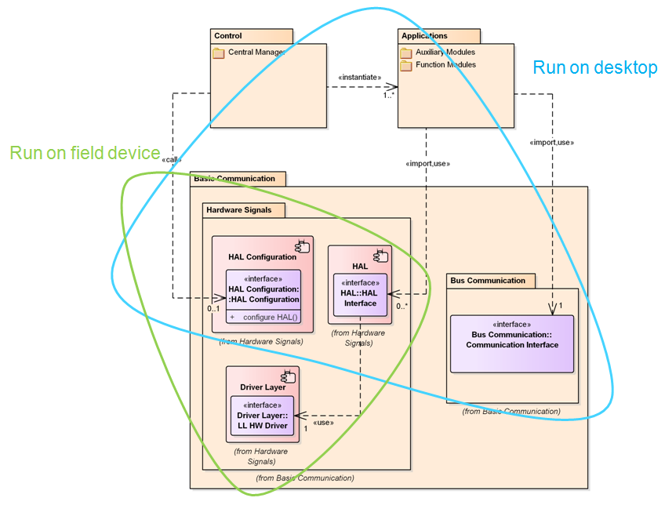

Title: 嵌入式系统的单元测试
Date: 2016-11-16 15:40
Modified: 2016-11-16 15:40
Slug: unit-test-for-embedded-system
Authors: Joey Huang
Summary: 嵌入式系统有大量的和硬件打交道的代码，如何做单元测试？
Status: draft

## 什么是单元测试

* 单元测试的对象：单元测试是针对一个个模块里的功能接口进行的测试，是最基础的测试。比如，一个 C 语言模块有 5 个内部函数，2 个外部函数。则这 7 个函数都需要做单元测试。我们称为分层单元测试。针对外部函数，我们称为 level 1 测试，针对内部函数，我们称为 leve 2 测试。
* 模块隔离：单元测试需要保证模块隔离。即，只测试待测函数的正确性，不去管待测函数所调用的外部模块的函数的正确性。通过模块隔离，可以把焦点放在待测函数本身，而不是整个系统的依赖上。

## 单元测试的准备工作

* 模块化设计：良好的模块化设计以及模块间接口定义是单元测试和集成测试的先决条件。
* 函数式编程：尽量使用函数式编程，定义清晰的输入和输出。这样的函数更容易进行测试。一句话概括函数式编程：不管在什么条件下，相同的输入参数调用一个函数得到的输出也是相同的。全局变量是破坏模块可测试性的最大元凶。相同的输入，在不同的全局变量情况下，得到的输出是不一样的。这样的代码很容易引入 Bug 且不好追查。

## 单元测试框架

适用于嵌入式系统的单元测试框架不多。开源的有 [unity](https://mark-vandervoord-yxrv.squarespace.com/unity) & [cmock](https://mark-vandervoord-yxrv.squarespace.com/cmock)。商业化的如 [vectorcast](http://www.vectorcast.com/software-testing-products) 等。

评估一个单元测试的框架，可以从以下几个角度来看：

* 基础功能
    * 提供单元测试例编写环境（宏，脚手架函数，ASSERT 函数等）
    * 提供单元测试例的执行环境（开发机执行，真机执行等）
    * 输出单元测试报告
    * 与 IDE 等开发工具集成
* 高级功能：自动化
    * 打桩 (Stubbing)：通过分析源码，生成待测代码所依赖的外部模块的桩代码。这样执行单元测试时，就可以和依赖的模块隔离开来。好的单元测试框架可以自动生成桩代码。
    * 模拟 (Mock)：生成测试依赖的模拟函数。这个和打桩很类似，唯一不同的是 Mock 可以包含 Assert 和 Expectations 。比如，Mock 可以检查待测代码是否以正确的参数及顺序来调用被调函数。测试框架应该提供一组便利的工具来生成或创建模拟函数。
    * 自动生成测试例：给定一组代码，测试框架可以自动测试部分测试例。减少单元测试和自动化测试所花费的时间。提高单元测试的代码覆盖率。

## 嵌入式单元测试的范围

硬件驱动，包括操纵寄存器，写存储器等必须在硬件环境上执行单元测试。其他的可以在开发机 (PC) 上执行测试。

## 单元测试的不足

* 很多单元测试只能在开发机上运行，运行环境的差异以及编译器的差异就无法体现出现
* 与硬件相关的驱动很难进行单元测试

单元测试不能解决所有问题，否则就不需要集成测试和系统测试了。但没有单元测试，就像在浮沙上筑高塔。

## 一个例子

以 unity & cmock 为例，演示如何进行单元测试。
