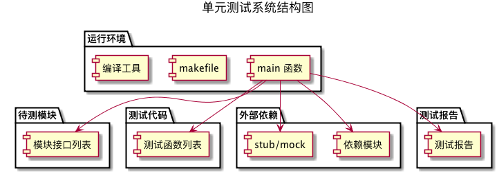

Title: 嵌入式系统的单元测试
Date: 2016-11-16 15:40
Modified: 2016-11-16 15:40
Slug: unit-test-for-embedded-system
Authors: Joey Huang
Summary: 嵌入式系统有大量的和硬件打交道的代码，如何做单元测试？
Status: draft

## 什么是单元测试

* 单元测试的对象：单元测试是针对一个个模块里的功能接口进行的测试，是最基础的测试。比如，一个 C 语言模块有 5 个内部函数，2 个外部函数。则这 7 个函数都需要做单元测试。我们称为分层单元测试。针对外部函数，我们称为 level 1 测试，针对内部函数，我们称为 leve 2 测试。
* 模块隔离：单元测试需要保证模块隔离。即，只测试待测函数的正确性，不去管待测函数所调用的外部模块的函数的正确性。通过模块隔离，可以把焦点放在待测函数本身，而不是整个系统的依赖上。

## 软件可测性

* 模块化设计：良好的模块化设计以及模块间接口定义是单元测试和集成测试的先决条件。
* 函数式编程：尽量使用函数式编程，定义清晰的输入和输出。这样的函数更容易进行测试。一句话概括函数式编程：不管在什么条件下，相同的输入参数调用一个函数得到的输出也是相同的。全局变量是破坏模块可测试性的最大元凶。相同的输入，在不同的全局变量情况下，得到的输出是不一样的。这样的代码很容易引入 Bug 且不好追查。

## 桩函数和模拟对象

为什么需要桩函数和模拟对象呢？这是因为待测软件可以会调用外部模块接口，甚至访问硬件寄存器。这部分必须用假的，模拟的接口或对象来实现。这样对待测函数而言，它才能具备完整的运行环境。

* stub: 桩函数，即把要进行单元测试的外部依赖函数，使用一个假的函数返回一个预设的值。
* mock: 模拟对象，除了 stub 的功能外，还可以去检查待测函数使用 mock 对象的方式，比如传入 mock 对象函数的参数以及调用次数以及顺序等。

## 测试运行环境

针对嵌入式系统，运行环境分为软件模拟环境和硬件环境两种。

* 软件模拟环境：单元测试运行在 PC 上或运行在 PC 端的模拟器上，比如 IAR Simulator。
* 硬件运行环境：单元测试直接运行在硬件设备上

一般而言，尽量使用软件模拟环境。这样效率更好，测试系统更简单。另外，硬件运行环境会有一些限制，比如单元测试代码加上单元测试框架编译完的可执行文件一般会较大，不太适合资源非常受限的硬件平台。典型地，一个最简单的 unity 单元测试可执行文件，编译完大概有将近 30 KB，根本无法运行在 PIC (4KB ROM, 256 RAM) 硬件上。

一般来讲，单元测试不推荐在硬件环境下执行，Unity 官方文档上给出的理由是：

* On hardware, you have too many constraints (processing power, memory, etc)
* On hardware, you don’t have complete control over all registers.
* On hardware, unit testing is more challenging
* Unit testing isn’t System testing. Keep them separate.

## 鉴别单元测试的对象

### 不适合做单元测试的对象

* 运行在资源非常受限的硬件平台上的嵌入式软件，如 PIC
* 设备驱动程序：比如串口驱动，或 LCD 驱动等
* 界面相关程序：这里主要是两个原因，一是界面变化较频繁，不适合做单元测试；二是界面单元测试成本较好，架构较复杂

### 适合做单元测试的对象

* 有清晰的功能接口的独立模块

### 需要生成桩代码或模拟对象的代码

理论上讲，**待测功能模块所依赖的所有外部软件，都需要使用桩代码或模拟对象来处理**。从这个角度来讲，模块化设计，减少依赖和耦合是提高软件可测性的主要方法。

从实践的角度来讲，有些依赖可以不需要使用桩函数来替代，这样的单元测试就过度到了集成测试了。一般来讲，进行单元测试时，需要用桩代码或模拟对象来替代的内容有：

* 依赖的硬件寄存器等相关资源
* 无法在软件模拟环境下运行的中间件：比如 i-jia 系统里的 ZigBee 协议栈
* 某些嵌入式操作系统的特殊功能组件

## 单元测试的原理

一个完整的单元测试环境包含以下几部分：

* 待测模块：开发人员编写的，需要进行单元测试的代码模块
* 测试代码：开发人员编写的，用来测试待测模块的代码。一般情况下，测试代码会和某个单元测试框架关联起来
* 外部依赖：有些外部依赖可以直接由待测模块调用并运行，有些外部依赖需要用 stub/mock 对象替换
* 运行环境：一个单元测试软件包一般包含一个 main 函数以便在模拟环境下编译并运行。此外，还有 makefile 以及编译工具链等
* 测试报告：单元测试需要输出测试报告，最简单的直接输出到 stdout 上，更智能的，可以把测试报告自动上传，集中管理，以及测试失败时自动邮件通知等



## 实例

比如，我们有一个工程测试程序，运行在 CC2530 上，程序的功能是通过串口从上位机读取测试指令，分析测试指令，执行测试指令，通过串口上报测试结果给上位机。

在这个程序里，在设计阶段，把外部依赖用清晰的接口封装，测试程序本身使用模块化设计，定义清晰的外部接口以及状态机流程。这样设计出来的功能模块才具备可测试性。如果外部依赖（串口通信，测试执行）没有清晰地封装，散落在模块本身的逻辑处理代码里，这样的代码将不具备可测性。

### 外部依赖

* 串口通信：包括接收上位机的串口数据以及通过串口发送测试报告给上位机。这个可以使用 stub/mock 对象来处理。
* 测试指令执行器：很多测试指令执行和硬件相关，是不可测的，比如测试射频指标，读取写在 Flash 上的软件版本号，这些必须使用 stub/mock 进行处理。

### 可测部分

* 与上位机通信协议：可以通过设计单元测试，确保通信协议的正确性
* 测试命令集合：通过设计单元测试，确保所有支持的测试命令都是可用的
* 工程测试程序主流程：做好依赖部分代码打桩后，输入就是上位机的串口输入的测试命令，输出就是给上位机发送的测试结果。这是 level 1，即模块外部接口测试

### 可测试性评估

* 清晰依赖模块封装
* 清晰的模块化接口设计
* 可测部分是否是相对稳定不变的：针对我们的例子，这个是相对固定的。
* 可测部分是否可以做成模块化且可重用：针对我们的例子，不同的产品虽然测试命令集合上会有些差异，但是共用同一套通信协议。

## 单元测试框架

适用于嵌入式系统的单元测试框架不多。开源的有 [unity](https://mark-vandervoord-yxrv.squarespace.com/unity) & [cmock](https://mark-vandervoord-yxrv.squarespace.com/cmock)。商业化的如 [vectorcast](http://www.vectorcast.com/software-testing-products) 等。

评估一个单元测试的框架，可以从以下几个角度来看：

> 资源来源：从 SDIP 《Unit test recommendation -v2》 材料归纳总结而来。

* 基础功能
    * 提供单元测试例编写环境（宏，脚手架函数，ASSERT 函数等）
    * 提供单元测试例的执行环境（开发机执行，真机执行等）
    * 输出单元测试报告
    * 与 IDE 等开发工具集成
* 高级功能：自动化
    * 打桩 (Stubbing)：通过分析源码，生成待测代码所依赖的外部模块的桩代码。这样执行单元测试时，就可以和依赖的模块隔离开来。好的单元测试框架可以自动生成桩代码。
    * 模拟 (Mock)：生成测试依赖的模拟函数。这个和打桩很类似，唯一不同的是 Mock 可以包含 Assert 和 Expectations 。比如，Mock 可以检查待测代码是否以正确的参数及顺序来调用被调函数。测试框架应该提供一组便利的工具来生成或创建模拟函数。
    * 自动生成测试例：给定一组代码，测试框架可以自动测试部分测试例。减少单元测试和自动化测试所花费的时间。提高单元测试的代码覆盖率。

## 嵌入式单元测试的范围


硬件驱动，包括操纵寄存器，写存储器等必须在硬件环境上执行单元测试。其他的可以在开发机 (PC) 上执行测试。

## 单元测试的不足

* 很多单元测试只能在开发机上运行，运行环境的差异以及编译器的差异就无法体现出现
* 与硬件相关的驱动很难进行单元测试

单元测试不能解决所有问题，否则就不需要集成测试和系统测试了。但没有单元测试，就像在浮沙上筑高塔。

## Unity

### Unity 介绍

Unity 是一个轻量级的，为嵌入式而量身定制的单元测试框架，它有以下几个特点：

* 纯 C 语言实现：只依赖 ANSI C 标准库。
* 可移植性：可以运行在 8bit 低端的单片机也可以运行在 64bit 高端处理器上。框架上提供了目标环境的的配置，如 int 占几个字节，是否支持浮点数运行等等。
* 丰富的断言库：Unity 提供了丰富的断言库，可以处理数值，字符串，数组等断言处理。
* 小巧：核心代码 `unity.c` 总共在 1500 行左右。一个简单的单元测试例，编译出来大概在 25-30 KB 左右。在目标硬件上可能显得有点大，但在模拟器或 PC 上，这个尺寸的应用编译和运行都非常快。
* 集成简单：可以非常方便地和交叉编译工具集成。只需要在测试代码里 `include "unity.h"` ，并且把 `unity.c` 加进去参加编译即可。
* 可扩展性：编写自己的断言或者扩展 cmock 等，可以提供丰富的功能。再如，unity 默认输出测试报告到 stdout 上，如果需要也可以简单地定制，让测试报告通过串口输出。

### Unity 单元测试程序

一个 Unity 单元测试的组成部分：

* 待测模块：需要进行单元测试的代码模块
    * 模块化设计，低耦合，高内聚。关注软件的可测试性。
* 测试代码：用来测试待测模块的代码
    * include "unity.h"
    * 使用 Unity 的断言库来对待测函数进行测试
* 测试执行器代码：测试执行器包含一个 `main()` 函数，在 `main()` 函数里去执行所有的测试例，并输出测试报告。
    * Untiy 提供了一个 Ruby 脚本 `generate_test_runner.rb` 来生成测试执行器代码模板
    * 脚本会根据规则 (以 `test` 打头的函数，会被认为是测试例函数) 自动生成执行器
* Makefile：一个 makefile 是为了把上面所有的东西合在一起，提供方便的 cli 接口
    * 给每个待测模块生成一个可执行的测试程序
    * 运行所有的测试程序，输出测试报告

具体查阅 [Unity Example 1](https://github.com/ThrowTheSwitch/Unity/tree/master/examples/example_1) 。

### 单元测试组织方式

上一个例子里，每个待测模块和其测试代码都会生成一个可执行文件。能不能把几个待测模块生成在同一个测试执行器里呢？答案是肯定的。可以使用 `Unity Fixture` 扩展来解决测试例的组织问题。

具体查阅 [Unity Example 2](https://github.com/ThrowTheSwitch/Unity/tree/master/examples/example_2) 。

### 自动化脚本

测试执行器代码看起来千篇一律，能不能更智能地把测试执行器和 Makefile 都用脚本自动化解决掉呢？答案是肯定的，最开始的时候，Unity 提供了一些 Ruby 自动化的脚本。

具体可查阅 [Unity Example 3](https://github.com/ThrowTheSwitch/Unity/tree/master/examples/example_3) 。

后面，这块继续发展，就产生了 Ceedling 项目。我们后续会介绍。

### 输出报告

Unity 默认会输出测试报告到 stdout 上。如果有更复杂的需求，可以把报告保存起来，转换成 JUnit 格式的输出报告，并且和 Jenkins 等持续集成工具整合在一起。

## CMock

上面介绍 Unity 时，遗留了一个重要的问题，怎么解决依赖问题？比如待测模块 A 依赖模块 B，B 又依赖模块 C ，模块 C 又依赖硬件，怎么给模块 A 做单元测试？一个方法是实现一套假的 B 模块，和真正的 B 模块提供一样的接口，然后和模块 A 以及模块 A 的测试代码编译在一起，这样就可以实现了依赖隔离。

但如果要手动去写这些依赖模块，会很繁琐。解决方案就是 [cmock](https://github.com/ThrowTheSwitch/CMock) 。它是一套 Ruby 脚本。当要生成一个 “假模块” 时，只需要输入这个模块的头文件，cmock 就会帮你生成这个假模块的实现代码。

```
$ ruby cmock.rb super.h duper.h awesome.h
```

上面的脚本，就会为三个模块生成 mock 对象。

假设一个头文件里有以下函数：

```c
int DoesSomething(int a, int b);
```

cmock 除了生成同样的函数体实现外，还会根据这个函数原型，生成下面的辅助函数：

```c
// 检查桩函数的输入以及返回一个指定的输出
void DoesSomething_ExpectAndReturn(int a, int b, int toReturn);
// 检查桩函数的输入，然后抛出一个异常
void DoesSomething_ExpectAndThrow(int a, int b, EXCEPTION_T error);
// 使用回调函数来替代目标桩函数
void DoesSomething_StubWithCallback(CMOCK_DoesSomething_CALLBACK YourCallback);
// 不检查这个桩函数，直接返回一个指定值
void DoesSomething_IgnoreAndReturn(int toReturn);
```

有了这些辅助函数，我们就很容易在测试代码里用起来，来检查待测模块使用依赖模块的情况。

```c
test_CallsDoesSomething_ShouldDoJustThat(void)
{
    DoesSomething_ExpectAndReturn(1,2,3);
    DoesSomething_ExpectAndReturn(4,5,6);
    DoesSomething_ExpectAndThrow(7,8, STATUS_ERROR_OOPS);

    CallsDoesSomething( );
}
```

这段测试代码里，`CallsDoesSomething()` 就是我们的待测函数，这个函数运行后，应该要调用外部依赖函数 `DoesSomething()` 三次。且以指定的参数调用的。

除此之外， cmock 还有一系列的配置项，比如定义生成的 mock 代码存放位置之类的。详细信息可查阅 [cmock summary](https://github.com/ThrowTheSwitch/CMock/blob/master/docs/CMock_Summary.md) 。

## Ceedling

### Ceedling 介绍

有了 Unity 和 CMock，我们的单元测试基本完整了。但还有一个很烦心的事情，要把 Unity 单元测试代码和待测模块代码以及 CMock 生成的桩代码整合起来，你得写很多胶水代码把这些东西整合起来才行。这是个很费力，而且重复，没技术含量的工作。

为了解决这个问题，Unity 团队开发了 Ceedling 。[Ceedling](https://github.com/ThrowTheSwitch/Ceedling) 使用 Rake 编译系统 (基于 Ruby 的编译管理系统，和 Makefile 实现类似的功能)，它根据一些预定义的规则，自动把 Unity 和 CMock 整合起来。

我们回忆一下，如果使用 Unity + CMock 怎么样来进行单元测试？

* 筛选出待测模块代码
* 鉴别出待测模块代码所依赖的外部模块
* 使用 cmock 生成桩代码
* 使用 unity 编写单元测试代码
* 生成测试代码执行器
* 编写 makefile ，把待测模块，测试代码，unity, 桩代码，测试代码执行器全部整合在一起，生成一个可执行文件
* 运行这个可执行文件得到测试报告

而使用 Ceedling 后，上述步骤简化为：

* 筛选出待测模块代码
* 鉴别出待测模块代码所依赖的外部模块
* 按照 Ceedling 规则编写单元测试代码
* 运行这个可执行文件得到测试报告

这就是 Ceedling 带来的价值。那么到底怎么样使用 Ceedling 规则来编写单元测试代码呢？

### 描述待测模块和依赖关系

Ceedling 直接在单元测试代码里描述待测模块和依赖关系，我们直接看一个例子：

```c
#include "unity.h"     // Ceedling 会自动把 unity.c 加进编译系统编译，作为单元测试框架使用
#include "types.h"     // 没有对应关系的头文件，Ceedling 不会去编译和链接
#include "foo.h"       // Ceedling 会自动找到 foo.c ，并且把 foo.c 作为待测模块代码，加进编译系统进行一块儿编译
#include "mock_bar.h"  // 以 mock_ 打头的文件，Ceedling 会自动找到 bar.h，并以此为输入生成桩代码 mock_bar.h 以及 mock_bar.c ，
                       // 其中 mock_bar.c 会自动加入编译系统一块儿编译。这样就实现了自动打桩的过程
#include "baz.h"       // Ceedling 会自动找到 baz.c 并加入参加编译。即我们决定把依赖模块 baz.c 直接加入进来参加编译，不打桩。
                       // 这个已经类似在进行集成测试了。需要注意：不打桩的模块，必须加入到 support 模块中，具体参阅官方文档。

/* 接下来，按照 Unity 规则编写常规测试例就好。需要注意的事，测试函数命名规则：必须以 test 打头，这样 Ceedling 才会自动把这个函数加到测试执行器里调用。 */

void setUp(void) {}    // every test file requires this function;
                       // setUp() is called by the generated runner before each test case function

void tearDown(void) {} // every test file requires this function;
                       // tearDown() is called by the generated runner before each test case function

// a test case function
void test_Foo_Function1_should_Call_Bar_AndGrill(void)
{
    Bar_AndGrill_Expect();                    // setup function from mock_bar.c that instructs our
                                              // framework to expect Bar_AndGrill() to be called once
    TEST_ASSERT_EQUAL(0xFF, Foo_Function1()); // assertion provided by Unity
                                              // Foo_Function1() calls Bar_AndGrill() & returns a byte
}

// another test case function
void test_Foo_Function2_should_Call_Baz_Tec(void)
{
    Baz_Tec_ExpectAnd_Return(1);       // setup function provided by mock_baz.c that instructs our
                                       // framework to expect Baz_Tec() to be called once and return 1
    TEST_ASSERT_TRUE(Foo_Function2()); // assertion provided by Unity
}
```

关于 Ceedling 的详细信息可参阅官方文档 [CeedlingPacket.md](https://github.com/ThrowTheSwitch/Ceedling/blob/master/docs/CeedlingPacket.md) 。

### 例子

另外，Ceedling 还提供了两个真实的嵌入式环境的例子。一个是在开源硬件平台 Arduino UNO 实现的一个闪灯应用，这个是真实嵌入式硬件平台上的一个例子，可以关注的信息包括：

* 如何使用 Ceedling 组织代码目录结构
* 如何使用 Ceedling 规则编写单元测试代码
* 如果配置 Ceedling 项目进行交叉编译
* 如何利用 support 处理硬件寄存器依赖

详细代码可参阅 [blinky](https://github.com/ThrowTheSwitch/Ceedling/tree/master/examples/blinky) 。

### Ceedling 的缺陷

Ceedling 可以让单元测试更简单和自动化。如果要在产品中使用，有一些问题，一是使用人员需要熟悉 Rake ，这是个新的编译系统，虽然不难但毕竟是新东西。二是，很多产品还是使用 Makefile 作为编译系统，需要写一些胶水代码，把 Makefile 和 Ceedling 的编译系统整合起来。因为 Ceedling 目前只支持简单的目标生成，如果要生成复杂的复合目标，如 Bootloader, Application, Share Libraries 等组合，则 Ceedling 目前还无法支持。下面是官方文档的描述：

> Ceedling is primarily meant as a build tool to support automated unit testing. All the heavy lifting is involved there. Creating a simple binary release build artifact is quite trivial in comparison. Consequently, most default options and the construction of Ceedling itself is skewed towards supporting testing though Ceedling can, of course, build your binary release artifact as well. Note that complex binary release artifacts (e.g. application + bootloader or multiple libraries) are beyond Ceedling's release build ability.


