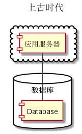
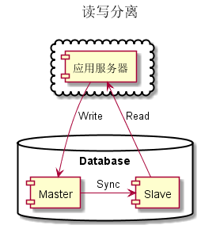
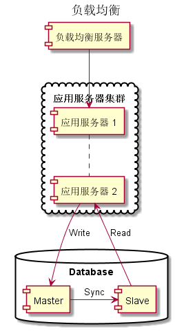
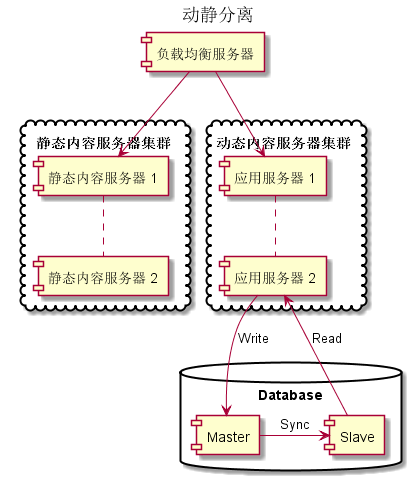
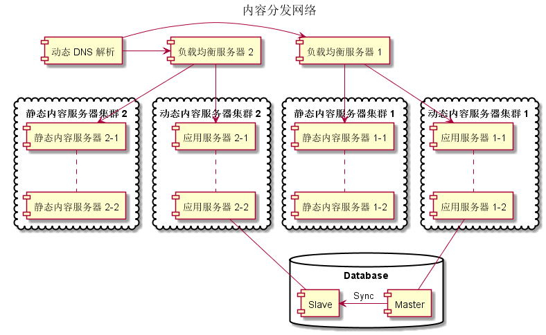

Title: 白话网站架构演进
Date: 2016-11-14 23:52
Modified: 2016-11-14 23:52
Tags: web
Slug: web-arch-evolution
Authors: Joey Huang
Summary: 读写分离，负载均衡，DNS 动态解析，CDN, memcached, Redis, 动态扩容，你是否曾经被这些名词搞得晕头转向，然后发誓要搞清楚这些概念，然后就没有然后了。或许这篇文章可以让你下次和程序员聊天时可以插一两句话。

这是一篇写给外行人看的文章，因为我本身也是外行，写不出给内行人看的文章。所有的架构演进不外乎两个原因：

* 用户越来越多
* 数据越来越多

## 上古时代

实际上，上古时代并遥远，大概在 30 年前吧，甚至更近。那个时候上网的人很少，网站架构简单地一踏糊涂。

就一个数据库加一个应用服务器，应用服务器直接开门迎客。有时候，数据库和应用服务器还运行在同一台主机上，简洁得一踏糊涂。如果你认为这种架构只能做简单的事情，那就错了。这种架构也不泛一些大型的应用场景，典型的如银行的信息系统。只是，主机要用 IBM 的大型机，数据库用 Oracle，存储器要用 EMC 。这种架构还有一个特点是贵，死贵。多年之后，一场轰轰烈烈地去 IOE 运行席卷神州大地，前期就是为了解决贵的问题，当然这是后话了。

## 读写分离

数据库在执行写操作时，需要锁定数据表，这是为了保持数据一致性。相像一下，数据库写了一半，有人读取了数据，它读出来的数据可能是不完整的。

这带来的一个问题，当数据库写得比较频繁，读往往得不到执行，因为数据库老是被锁住。表现在用户层面，一个网页显示得好久都显示不出来，不是因为网络慢，而是因为数据库的读操作得不到执行。

读写分离就是为了解决这个问题的，核心要点是一个 Master 数据库负责数据写入，另外有一到多个 Slave 数据库负责数据读取。Master 和 Slave 之间的数据会自动同步。

## 负载均衡

随着用户量越来越多，应用服务器开始忙不过来了。假设一个应用服务器可以运行 10 个 worker 线程，每个 worker 线程给用户提供服务的时间需要 10 毫秒，那么一个应用服务器只能满足 1000 次/秒的服务请求。超过了这个量级，就需要增加应用服务器，这个时候就引入了负载均衡服务器。

负载均衡服务器负责接收用户发过来的请求，然后看哪个应用服务器比较有空闲，就把请求发送给相应的应用服务器执行。就像部门领导一样，本身自己不做事，只负责把任务分配给空闲的工程师。

## 动静分离

网站有静态内容和动态内容之分，比如我们上新浪微博网站，网站上的 Logo 就属于静态内容，它是不变的 (这里是指用户无法改变它，实际上微博的开发工程师是可以，也会改变它的)，而用户发的微博属于动态内容，它是频繁改变的。用更专业的术语讲，JavaScript，CSS，网站图片属于静态内容。

为了进一步提高性能，可以把静态的内容和动态的内容分离，分别放在不同的服务器上。毕竟，静态的内容不需要读数据库，也不需要经过应用服务器的逻辑运算，可以直接把静态内容发送给用户。这样可以减少中间交互环节，从而提高效率。

## 内容分发网络

当用户进一步增长，一个负载均衡服务器搞不定了。更要命的是，北方的用户访问速度还可以，南方的用户访问起来奇慢无比。这个时候，CDN 闪亮登场了。

CDN 全称是内容分发网络 (Content Delivery Network)，它的原理很简单，让一个区域的用户访问那个区域的服务器。比如北方用户从青岛服务器获取数据，华南用户从杭州服务器获取数据，西南用户从广州服务器获取数据。这种分而治之的策略特别适用于静态内容。

这里有一个问题，怎么样让一部分用户从 `负载均衡服务器 1` 访问，另外一部分从 `负载均衡服务器 2` 访问？

这里就涉及到**动态 DNS 解析**的技术，我们知道普通的 DNS 解析就是从一个域名获得一个或多个对应的 IP 地址信息，这个信息是不变的，即不管是北方用户还是南方用户，获取到的信息是一样的。而动态 DNS 解析，会根据用户的 IP 地址所在的地理位置以及所处的网络运营商的拓扑结构中的位置，返回最靠近的一个 IP 地址给用户。这样就实现了用户的分流，而且实现就近访问原则，从而提高效率。

## 数据库集群

